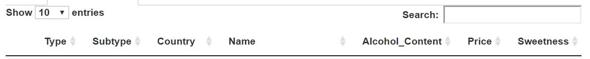
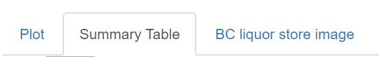
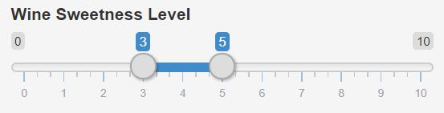

  Assignment 8
====================

__This is the Repository created by Zhenyi Huang.__

This assignment has adapted an abridged version of the [stat545.com shiny tutorial](http://stat545.com/shiny01_activity.html) written by Dean Attali, 
In this assignment, I have added various features shown as follow: 

## Features

* Add an option to sort the results table by price. By checking the below box, we can sort the table by descending price.

* Add an image of the BC Liquor Store to the UI. The following image is shown in the __BC Liquor Store Image__.

* Use the DT package to turn the current results table into an interactive table. The table now is interactive and different functions are shown on the bar above the table:

* Add parameters to the plot. With the below feature, the user could change the colour of the barplot to the colur they want.

* Place the plot and the table in separate tabs. Separate panels are used for better display of the apps. Users could switch between these three panels by clicking the below bar:

* When the user wants to see only wines, show a new input that allows the user to filter by sweetness level. Only show this input if wines are selected. The sweetness level would be an valid option if the wine button and the sort by sweetness buttons are chosen.

Users can define the range of sweetness level they would like to view using the slide bar.

## Shiny Apps

Please check this link [BC Liquor Store App](https://janehuang1647.shinyapps.io/bcl_assignment8/) for the better view of the app. 

## Files

For the original code, please check this link for the [Original file](https://github.com/STAT545-UBC-students/hw08-janehuang1647/blob/master/bcl_assignment8/app.R).

## Reference
* Copyright of the BC liquor Store image: 

https://www.google.ca/search?q=bc+liquor+store&source=lnms&tbm=isch&sa=X&ved=0ahUKEwjP29-YndfeAhWnhVQKHVyyCVIQ_AUIESgE&biw=1280&bih=530#imgrc=0L-2j93Px5x9YM

